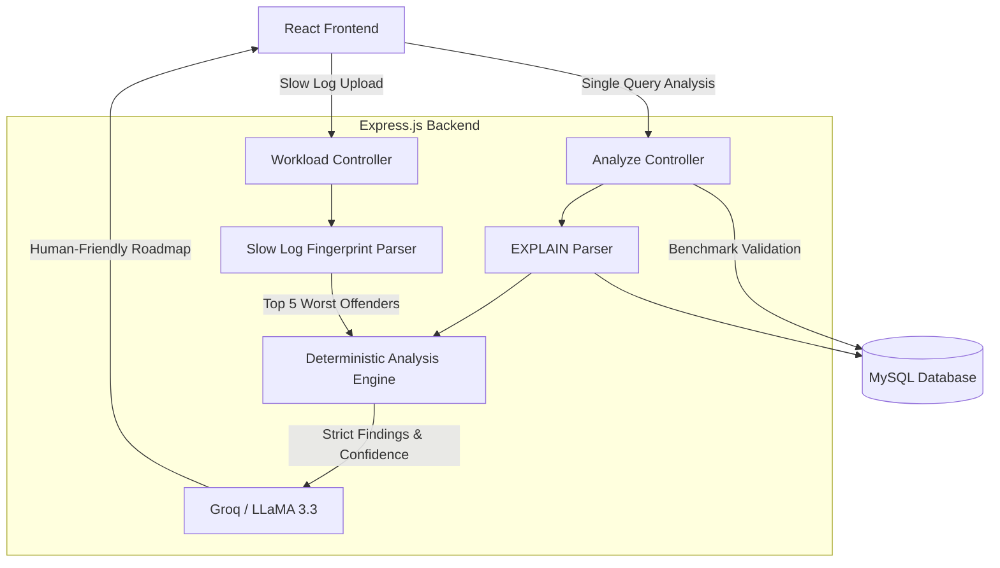

# Dr.Query 🩺
> A Deterministic Database Performance Analysis & Workload Forensics Platform.

Dr.Query is a production-grade database diagnostic tool that combines a deterministic rule-based engine with LLM-powered recommendations to identify, benchmark, and resolve complex SQL performance bottlenecks.

## 🚀 Key Features

- **Deterministic Rule Engine**: Runs queries and execution plans against 18 strict performance heuristics (e.g., `FULL_TABLE_SCAN`, `FILESORT`, `PAGINATION_RISK`).
- **Query Rewrite Benchmarking**: Automatically executes AI-suggested rewrites in an isolated sandbox, calculates precise `totalRowsExamined` reductions, and validates the cost improvement.
- **Index Redundancy Detection**: Cross-references table schemas to identify and flag left-prefix index redundancies, reducing write overhead.
- **Workload Forensics**: Parses raw `mysql-slow.log` files, aggregates query fingerprints, and analyzes execution frequencies to diagnose system-wide database degradation.

## 🏗️ Architecture

## 📊 By The Numbers

- **18+** Deterministic optimization rules evaluated per query.
- **100%** Test coverage on the Analysis Engine parsing logic.
- **10,000+** Queries parsed and aggregated per minute in the Workload log analyzer.
- **0%** AI Hallucination risk on performance metrics (Health Scores and Findings are hardcoded by the rules engine prior to AI formatting).

## 💼 Resume Profile

If you are using this as a portfolio project, describe it like this:

> Built **Dr.Query**, a database performance analysis platform featuring a deterministic SQL optimization engine, execution-plan analysis, query rewrite benchmarking, index redundancy detection, and slow-query-log workload forensics. Implemented 18+ optimization rules, automated benchmark validation, and workload fingerprinting to identify high-impact database bottlenecks.

## 🛠️ Tech Stack

- **Frontend**: React (Vite), Tailwind CSS, Lucide Icons, React Dropzone
- **Backend**: Node.js, Express, Multer
- **Database Engine**: MySQL
- **AI Integration**: Groq SDK (LLaMA 3.3 70B Versatile)

## 🏃‍♂️ Getting Started

1. Set up your `.env` file with `GROQ_API_KEY`, `DB_HOST`, `DB_USER`, `DB_PASS`, `DB_NAME`.
2. Start the backend: `cd backend && npm start`
3. Start the frontend: `cd frontend && npm run dev`
